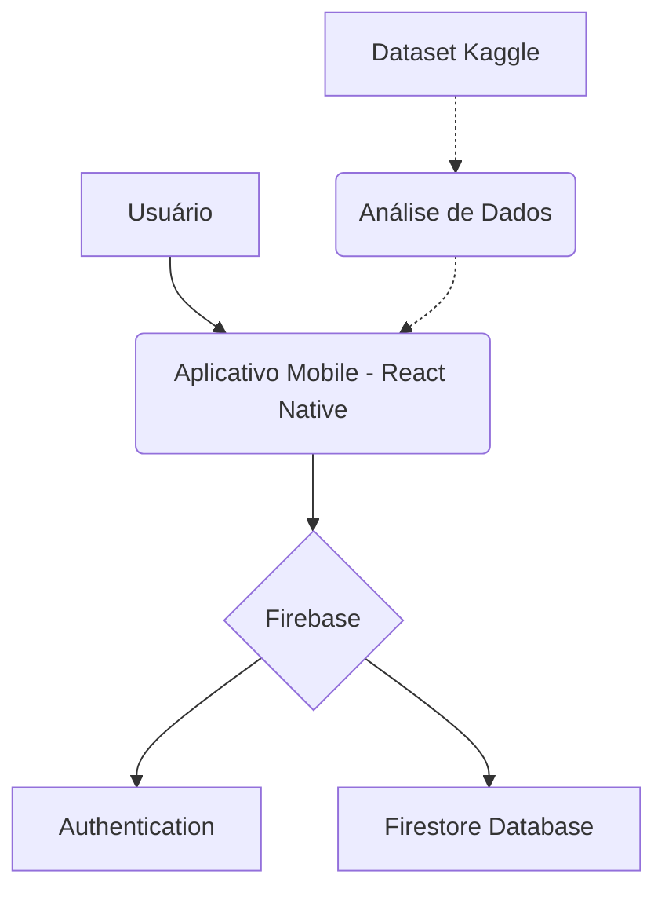

# Desenvolvimento em Sistemas de Informação (DSI)
<div align="center">
    
    &nbsp;&nbsp;
    
    &nbsp;&nbsp;
    
    &nbsp;&nbsp;
    
    &nbsp;&nbsp;
</div>

## Aplicativo Mobile para Análise de Dados de Reservas Hoteleiras

Este projeto consiste no desenvolvimento de um aplicativo mobile como parte da avaliação da disciplina de **Desenvolvimento em Sistemas de Informação** da Universidade Federal Rural de Pernambuco (UFRPE). O objetivo é aplicar conceitos de desenvolvimento de software na criação de uma ferramenta funcional baseada na análise de um conjunto de dados.

O aplicativo será construído a partir dos insights extraídos do dataset *[Hotel Booking Demand](https://www.kaggle.com/datasets/jessemostipak/hotel-booking-demand)*, que contém informações sobre reservas em hotéis urbanos e resorts.

**Integrantes do Grupo:**
* Douglas Wesley
* Elton Costa
* Júlia Karolyne
* Renato Samico
* Weslley Gabriel

---

## 🛠️ Tecnologias Utilizadas

A construção deste projeto se baseará nas seguintes tecnologias:

| Tecnologia | Descrição |
| --- | --- |
| **React Native** | Framework para desenvolvimento de aplicativos móveis multiplataforma (iOS/Android). |
| **TypeScript** | Superset do JavaScript que adiciona tipagem estática ao código, aumentando a robustez. |
| **Firebase** | Plataforma do Google utilizada para o backend, incluindo banco de dados (Firestore/Realtime Database) e autenticação. |

---

## 🏗️ Arquitetura do Sistema

*Nesta seção, vocês poderão adicionar um diagrama que ilustre a arquitetura do aplicativo, mostrando a interação entre o frontend mobile, os serviços do Firebase e a fonte de dados.*


---

## 🚀 Como Começar

Siga as instruções abaixo para configurar o ambiente de desenvolvimento e executar o projeto localmente.

### Pré-requisitos

Antes de começar, você precisará ter as seguintes ferramentas instaladas em sua máquina:
* [Node.js](https://nodejs.org/en/)
* [Yarn](https://yarnpkg.com/) ou [NPM](https://www.npmjs.com/)
* Ambiente de desenvolvimento React Native configurado (siga o [guia oficial](https://reactnative.dev/docs/environment-setup))
* Um emulador Android (Android Studio) ou iOS (Xcode)

### Instalação

1. **Clone o repositório:**
   ```bash
   git clone https://github.com/dsnato/dsi-ufrpe.git
   ```

2. **Acesse a pasta do projeto:**
   ```bash
   cd dsi-ufrpe
   ```

3. **Instale as dependências:**
   ```bash
   npm install
   # ou
   yarn install
   ```

4. **Execute o aplicativo (exemplo para Android):**
   ```bash
   npm run android
   # ou
   yarn android
   ```
---
