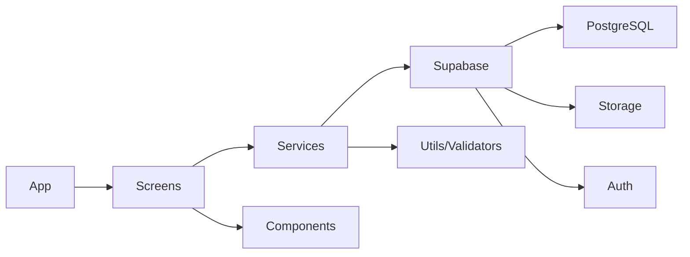

<div align="center">

# 🏨 Hostify - Sistema de Gestão Hoteleira

[](https://reactnative.dev/)
[](https://expo.dev/)
[](https://www.typescriptlang.org/)
[](https://supabase.com/)

**Sistema mobile completo de gestão hoteleira com Machine Learning para predição de cancelamentos**
</div>

---

## 📋 Sobre o Projeto

**Hostify** é um sistema mobile desenvolvido para a disciplina de **Desenvolvimento de Sistemas de Informação (DSI)** da **UFRPE**, que oferece uma solução completa para gestão de hotéis e resorts. O aplicativo combina operações CRUD tradicionais com recursos avançados de **Machine Learning** e **geolocalização**, proporcionando uma experiência moderna e eficiente para administradores hoteleiros.

### 🎯 Objetivos

- ✅ **Gestão Centralizada**: Controle completo de reservas, clientes, quartos, funcionários e atividades recreativas
- ✅ **Machine Learning**: Predição de cancelamento de reservas usando algoritmos de classificação
- ✅ **Dashboard Inteligente**: Visualização em tempo real de métricas e estatísticas do hotel
- ✅ **Geolocalização**: Integração com Google Maps para localização do estabelecimento
- ✅ **Autenticação Segura**: Sistema de login com controle de perfis (Admin/Usuário)

---

## 🚀 Funcionalidades Principais

### 📊 Dashboard Interativo

O coração do sistema é um **dashboard dinâmico** que oferece:

- 📈 **Visão Geral em Tempo Real**
  - Reservas confirmadas e ativas do dia
  - Taxa de ocupação de quartos (disponíveis vs. ocupados)
  - Total de clientes ativos no sistema
  - Atividades recreativas agendadas

- 🎨 **Cards Informativos Coloridos**
  - Sistema de cores intuitivo para cada módulo
  - Contadores automáticos de registros
  - Navegação rápida para telas de gerenciamento

- 🔄 **Atualização Automática**
  - Pull-to-refresh para recarregar dados
  - Sincronização instantânea com Supabase
  - Estatísticas calculadas dinamicamente

### 🤖 Predição de Cancelamento com Machine Learning

Um dos **destaques** do projeto é o módulo de **Machine Learning** que simula um modelo de classificação para prever cancelamentos:

#### 🧠 Como Funciona

1. **Distância Euclidiana**
   - Calcula similaridade entre a reserva atual e perfis de risco históricos
   - Compara múltiplas features (lead time, ADR, depósito, histórico, etc.)
   - Classifica em: Baixo Risco (15%), Médio Risco (50%), Alto Risco (85%)

2. **Análise de Confiança**
   - Mede a certeza da predição baseada na distância normalizada
   - Valores acima de 70% indicam alta confiabilidade
   - Exibe similaridade com cada perfil de risco

3. **Fatores Críticos**
   - Identifica elementos que influenciam a predição:
     - ✅ **Positivos**: Cliente repetido, pedidos especiais, depósito não reembolsável
     - ⚠️ **Negativos**: Cancelamentos anteriores, lead time muito alto, ADR baixa
   - Cada fator tem peso de importância (0-100%)

4. **Recomendações Inteligentes**
   - Ações sugeridas baseadas no nível de risco
   - **Baixo Risco**: Manter qualidade e confirmar próximo ao check-in
   - **Médio Risco**: Contato proativo, ofertas de upgrade, lembretes
   - **Alto Risco**: Ações urgentes (confirmação telefônica, política flexível)

#### 📝 Features Analisadas

```md
- Hotel Type (Resort vs. City Hotel)
- Lead Time (dias de antecedência)
- ADR - Average Daily Rate (taxa diária)
- Tipo de Depósito (Reembolsável/Não Reembolsável)
- Segmento de Mercado (Online/Agência/Direto)
- Histórico de Cancelamentos
- Cliente Repetido
- Pedidos Especiais
- Composição de Hóspedes (adultos/crianças)
- Duração da Estadia (fim de semana/semana)
```

#### 🎨 Interface Visual

- **Card de Risco**: Destaque visual com cor dinâmica (verde/amarelo/vermelho)
- **Gráficos de Similaridade**: Barras de progresso mostrando proximidade com perfis
- **Estatísticas da Análise**: Features analisadas, fatores críticos, ajustes aplicados
- **Cartões de Fatores**: Lista detalhada de elementos que influenciaram o resultado

### 🗺️ Integração com Google Maps

Funcionalidade **exclusiva** de geolocalização do hotel:

#### 🌍 Recursos do Mapa

- **Mapa Interativo Embarcado**
  - Google Maps API integrada via WebView
  - Marcador customizado com cores do sistema
  - InfoWindow automática com dados do hotel
  - Suporte completo para mobile e web

- **Geocodificação Automática**
  - Conversão automática de endereço em coordenadas (lat/long)
  - Usa OpenStreetMap Nominatim API
  - Validação de endereços em tempo real
  - Fallback para coordenadas padrão

- **Edição para Administradores**
  - Modal de edição exclusivo para usuários admin
  - Atualização de: Nome, Endereço, Cidade, Estado, CEP, Telefone
  - Coordenadas geradas automaticamente ao salvar
  - Persistência no Supabase (`hotel_config`)

- **Ações Rápidas**
  - Botão "Abrir no Mapa": Deep link para Google Maps nativo
  - Integração com app de telefone para ligação direta

```tsx
// Exemplo de configuração do mapa
<MapEmbed
    latitude={-8.1177}
    longitude={-34.8964}
    hotelName="Hostify Hotel & Resort"
    address="Av. Boa Viagem, 5000"
    city="Recife"
    state="PE"
/>
```

### 📦 CRUD Completo

Sistema robusto de operações para todas as entidades:

#### 👥 Gestão de Clientes
- ✅ Cadastro com validação de CPF, email e telefone
- ✅ Upload de foto de perfil via Supabase Storage
- ✅ Busca e filtros por nome, CPF
- ✅ Visualização detalhada de histórico de reservas

#### 🛏️ Gestão de Quartos
- ✅ Cadastro com tipo, capacidade, preço diário
- ✅ Upload de fotos do quarto
- ✅ Status em tempo real (Disponível/Ocupado/Manutenção)
- ✅ Filtros por tipo e disponibilidade

#### 📅 Gestão de Reservas
- ✅ Criação com seleção de cliente e quarto
- ✅ Cálculo automático de valor total
- ✅ Check-in/Check-out digital
- ✅ Status: Confirmada, Ativa, Finalizada, Cancelada
- ✅ Listagem com dados relacionados (join de clientes e quartos)

#### 💼 Gestão de Funcionários
- ✅ Cadastro com cargo, salário, data de admissão
- ✅ Controle de status (Ativo/Inativo)
- ✅ Validação de CPF e email únicos

#### 🎉 Gestão de Atividades Recreativas
- ✅ Agendamento de eventos e atividades
- ✅ Controle de capacidade máxima
- ✅ Preços e descrições detalhadas
- ✅ Status: Agendada, Em Andamento, Concluída, Cancelada

---

## 🛠️ Tecnologias

### Frontend
- **React Native** - Framework para apps mobile nativos
- **Expo** (~53.0) - Plataforma de desenvolvimento
- **TypeScript** - Tipagem estática para JavaScript
- **Expo Router** - Navegação baseada em arquivos
- **React Navigation** - Navegação entre telas

### Backend & Database
- **Supabase** - Backend as a Service
  - PostgreSQL (banco de dados relacional)
  - Auth (autenticação e autorização)
  - Storage (armazenamento de imagens)
  - Row Level Security (RLS)

### APIs & Integrações
- **Google Maps API** - Mapas interativos e geocodificação
- **OpenStreetMap Nominatim** - Geocodificação de endereços
- **React Native WebView** - Renderização de conteúdo web

### UI/UX
- **@expo/vector-icons** - Ícones Ionicons
- **React Native Safe Area Context** - Áreas seguras
- **React Native Gesture Handler** - Gestos e interações
- **Expo Image Picker** - Seleção de imagens

### Machine Learning (Simulação)
- **Algoritmos de Distância Euclidiana** - Similaridade entre features
- **Clustering K-Means** (conceitual) - Perfis de risco
- **Feature Engineering** - Normalização e mapeamento de dados

---

## 📥 Instalação

### Pré-requisitos

- Node.js (v18 ou superior)
- npm ou yarn
- Expo CLI (`npm install -g expo-cli`)
- Conta no Supabase (configurada)

### Passo a Passo

1. **Clone o repositório**
```bash
git clone https://github.com/dsnato/dsi-ufrpe.git
cd dsi-ufrpe-app
```

2. **Instale as dependências**
```bash
npm install
```

3. **Configure as variáveis de ambiente**

Crie um arquivo `.env` na raiz do projeto com suas credenciais do Supabase:

```bash
EXPO_PUBLIC_SUPABASE_URL=sua-url-do-supabase
EXPO_PUBLIC_SUPABASE_ANON_KEY=sua-chave-anonima-do-supabase
```

**Como obter suas credenciais:**
- Acesse [Supabase](https://supabase.com/) e crie uma conta (se não tiver)
- Crie um novo projeto
- Vá em **Settings** → **API**
- Copie a **Project URL** e a **anon/public key**
- Cole no arquivo `.env`

4. **Configure o banco de dados**

Execute os scripts SQL disponíveis no projeto:
- `SUPABASE_SETUP_SCRIPTS.sql` - Cria todas as tabelas
- Execute as políticas de RLS para segurança

5. **Execute o aplicativo**

```bash
# Inicia o servidor de desenvolvimento
npm start

# Para Android
npm run android

# Para iOS
npm run ios

# Para Web
npm run web
```

5. **Acesse o app**
- Escaneie o QR Code com o Expo Go (Android/iOS)
- Ou abra no emulador/simulador

---

## 🏗️ Arquitetura

### Estrutura de Pastas

```
dsi-ufrpe-app/
├── src/
│   ├── app/
│   │   ├── _layout.tsx              # Layout raiz
│   │   ├── index.tsx                # Redireciona para home
│   │   └── screens/
│   │       ├── home/                # 📊 Dashboard principal
│   │       ├── Login/               # 🔐 Autenticação
│   │       ├── Cliente/             # 👥 CRUD de clientes
│   │       ├── Quarto/              # 🛏️ CRUD de quartos
│   │       ├── Reserva/             # 📅 CRUD de reservas
│   │       ├── Funcionario/         # 💼 CRUD de funcionários
│   │       ├── Atividade/           # 🎉 CRUD de atividades
│   │       ├── Predicao/            # 🤖 ML - Predição de cancelamento
│   │       └── Localizacao/         # 🗺️ Mapa do hotel
│   ├── components/
│   │   ├── DashboardCard.tsx        # Card do dashboard
│   │   ├── StatCard.tsx             # Card de estatística
│   │   ├── QuickActionButton.tsx    # Botão de ação rápida
│   │   ├── MapEmbed.tsx             # 🗺️ Componente do mapa
│   │   ├── RiskCard.tsx             # Card de risco (ML)
│   │   ├── FormInput.tsx            # Input de formulário
│   │   ├── ButtonSelector.tsx       # Seletor de botões
│   │   └── ...
│   ├── services/
│   │   ├── clientesService.ts       # API de clientes
│   │   ├── quartosService.ts        # API de quartos
│   │   ├── reservasService.ts       # API de reservas
│   │   ├── funcionariosService.ts   # API de funcionários
│   │   ├── atividadesService.ts     # API de atividades
│   │   └── bookingPredictor.ts      # 🤖 Serviço de ML
│   ├── types/
│   │   ├── cliente.ts               # Interface Cliente
│   │   ├── quarto.ts                # Interface Quarto
│   │   ├── reservation.ts           # Interface Reserva
│   │   ├── funcionario.ts           # Interface Funcionário
│   │   └── atividade.ts             # Interface Atividade
│   └── utils/
│       ├── validators.ts            # Validações (CPF, email, etc.)
│       ├── formatters.ts            # Formatadores de dados
│       ├── dateUtils.ts             # Utilitários de data
│       └── bookingFeatureMapping.ts # Mapeamento de features ML
├── assets/
│   └── data/
│       └── booking_cancellation_model.json  # 📊 Dados do modelo ML
├── lib/
│   └── supabase.ts                  # Cliente Supabase
├── API_DOCUMENTATION.md         # 📚 Documentação da API
├── SUPABASE_SETUP_SCRIPTS.sql   # Scripts SQL do banco
└── ...
```

### Fluxo de Dados



---

## 📊 Banco de Dados

### Tabelas Principais

#### 1. **clientes**
```sql
- id (UUID, PK)
- nome_completo (TEXT)
- cpf (TEXT, UNIQUE)
- email (TEXT)
- telefone (TEXT)
- data_nascimento (DATE)
- endereco, cidade, estado, pais (TEXT)
- imagem_url (TEXT)
- created_at, updated_at (TIMESTAMPTZ)
```

#### 2. **quartos**
```sql
- id (UUID, PK)
- numero_quarto (TEXT, UNIQUE)
- tipo (TEXT)
- capacidade_pessoas (INT4)
- preco_diario (NUMERIC)
- status (TEXT)
- foto_quarto (TEXT)
- created_at, updated_at (TIMESTAMPTZ)
```

#### 3. **reservas**
```sql
- id (UUID, PK)
- id_cliente (UUID, FK)
- id_quarto (UUID, FK)
- data_checkin, data_checkout (DATE)
- numero_hospedes (INT4)
- valor_total (NUMERIC)
- status (TEXT)
- observacoes (TEXT)
- checkin_realizado_em, checkout_realizado_em (TIMESTAMPTZ)
- created_at, updated_at (TIMESTAMPTZ)
```

#### 4. **funcionarios**
```sql
- id (UUID, PK)
- nome_completo (TEXT)
- cpf (TEXT, UNIQUE)
- email (TEXT, UNIQUE)
- telefone (TEXT)
- cargo (TEXT)
- salario (NUMERIC)
- data_admissao (DATE)
- status (TEXT)
- created_at, updated_at (TIMESTAMPTZ)
```

#### 5. **atividades_recreativas**
```sql
- id (UUID, PK)
- nome (TEXT)
- descricao (TEXT)
- data_hora (TIMESTAMPTZ)
- local (TEXT)
- capacidade_maxima (INT4)
- preco (NUMERIC)
- status (TEXT)
- created_at, updated_at (TIMESTAMPTZ)
```

#### 6. **hotel_config**
```sql
- id (UUID, PK)
- nome (TEXT)
- endereco (TEXT)
- cidade (TEXT)
- estado (TEXT)
- cep (TEXT)
- telefone (TEXT)
- latitude (NUMERIC)
- longitude (NUMERIC)
- created_at, updated_at (TIMESTAMPTZ)
```

### Row Level Security (RLS)

Todas as tabelas possuem políticas de RLS para garantir segurança:

```sql
-- Políticas aplicadas a todas as tabelas
CREATE POLICY "Permitir leitura autenticada" ON tabela FOR SELECT TO authenticated USING (true);
CREATE POLICY "Permitir criação autenticada" ON tabela FOR INSERT TO authenticated WITH CHECK (true);
CREATE POLICY "Permitir atualização autenticada" ON tabela FOR UPDATE TO authenticated USING (true);
CREATE POLICY "Permitir exclusão autenticada" ON tabela FOR DELETE TO authenticated USING (true);
```

---

## 📚 Documentação

### Documentos Disponíveis

- 📄 [API_DOCUMENTATION.md](./API_DOCUMENTATION.md) - Documentação completa da API
- 📄 [SUPABASE_SETUP_SCRIPTS.sql](./SUPABASE_SETUP_SCRIPTS.sql) - Scripts de criação do banco
- 📄 [ROLES_DOCUMENTATION.md](./ROLES_DOCUMENTATION.md) - Sistema de perfis
- 📄 [GUIA_CONFIGURACAO_STORAGE.md](./GUIA_CONFIGURACAO_STORAGE.md) - Configuração de storage

### Exemplos de Uso

#### Criar uma Reserva

```typescript
import { criarReserva } from '@/src/services/reservasService';

const novaReserva = await criarReserva({
  id_cliente: 'uuid-do-cliente',
  id_quarto: 'uuid-do-quarto',
  data_checkin: '2025-12-01',
  data_checkout: '2025-12-05',
  numero_hospedes: 2,
  valor_total: 800.00,
  status: 'Confirmada'
});
```

#### Realizar Predição de Cancelamento

```typescript
import { predictCancellationRisk } from '@/src/services/bookingPredictor';

const resultado = predictCancellationRisk({
  hotel: 'Resort Hotel',
  lead_time: 45,
  adr: 150,
  deposit_type: 2, // Non Refund
  market_segment: 'Online TA',
  // ... outras features
});

console.log(`Risco: ${resultado.riskLevel}`);
console.log(`Probabilidade: ${resultado.probability}%`);
console.log(`Confiança: ${resultado.confidence}%`);
```

---

## 👥 Equipe

Desenvolvido por estudantes da **UFRPE** para a disciplina de **DSI (Desenvolvimento de Sistemas de Informação)**:

- **Douglas Wesley**
- **Elton Costa**
- **Júlia Karolyne**
- **Weslley Santiago**
- **Renato Samico**

---

## 📝 Licença

Este projeto foi desenvolvido para fins educacionais como parte da disciplina de **Desenvolvimento de Sistemas de Informação** da **UFRPE**.

---

## 🤝 Contribuindo

Contribuições são bem-vindas! Para contribuir:

1. Fork o projeto
2. Crie uma branch para sua feature (`git checkout -b feature/NovaFuncionalidade`)
3. Commit suas mudanças (`git commit -m 'Adiciona nova funcionalidade'`)
4. Push para a branch (`git push origin feature/NovaFuncionalidade`)
5. Abra um Pull Request

---

## 📞 Contato

Para dúvidas ou sugestões, entre em contato:

- **GitHub**: [@dsnato](https://github.com/dsnato)
- **Repositório**: [dsi-ufrpe](https://github.com/dsnato/dsi-ufrpe)

---

<div align="center">

**Feito com ❤️ por estudantes da UFRPE**

⭐ Se este projeto foi útil para você, considere dar uma estrela no repositório!

</div>